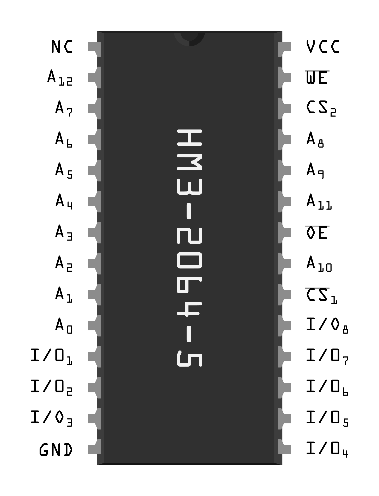
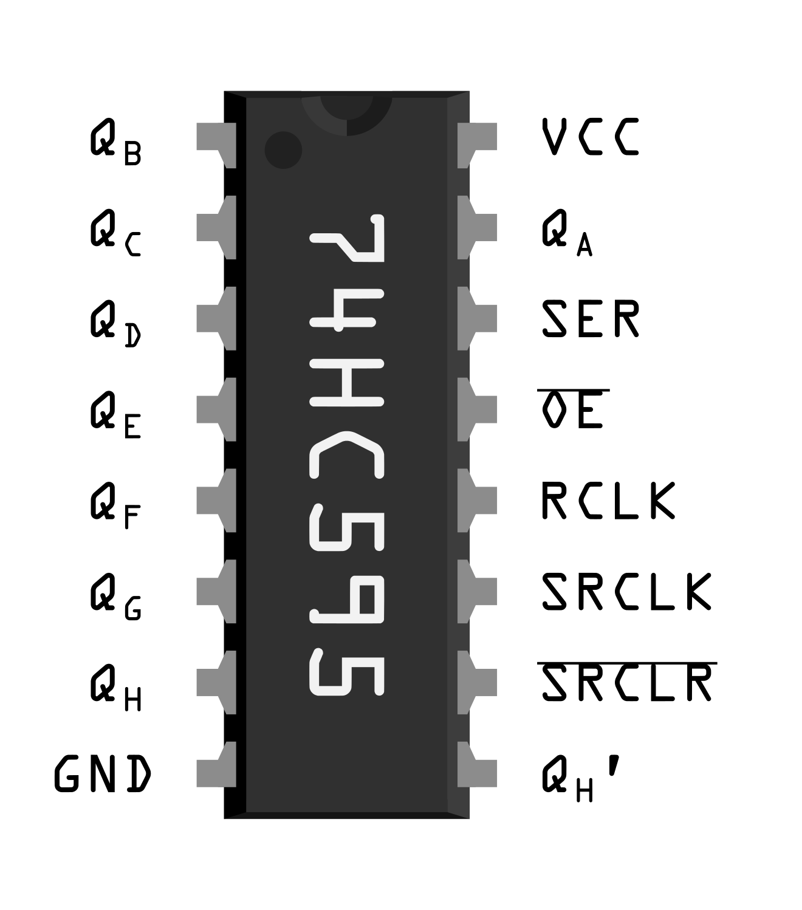

# External SRAM C++ Library for Arduino

This repository features a C++ library for an external SRAM for the Arduino Uno. More specifically the **HM3-2064-5** external RAM was used together with two **74HC595** shifting registers. This external RAM accepts $8192$ addresses each pointing to a single byte. The basic structure is, that the $13$-bit address is sent serially to the shifting registers and then the Arduino can perform a read or write on the specific address.\
As RAM access times are crucial for performance, the project is focused on reducing the overhead of the external RAM and shows the idea of using the faster internal RAM as a buffer - analog to how caching works on modern CPUs.

## 1 Hardware Setup
The pinout of the external SRAM **GM3-2064-5** can be seen in the graphic below. A<sub>0</sub> : A<sub>13</sub> are the pins for the $13$-bit address. I/O<sub>1</sub> : I/O<sub>8</sub> are I/O pins for the $8$ bit of the single byte at each specific address. For read and write operations, this library just uses the output enable pin <span style="text-decoration:overline">OE</span> and the write enable pin <span style="text-decoration:overline">WE</span>. Both chip select pins CS<sub>1</sub> and CS<sub>2</sub> are fixed and thus not controlled by the Arduino. Further information can be found in the corresponding datasheet.

<p align="center">

</p>

As the Arduino has only $20$ I/O pins, shifting registers are used to receive the $13$-bit address serially. This is done by connecting two $8$-bit serial input parallel output **74HC595** shifting registers together, where the corresponding output pins of each register are connected to A<sub>0</sub> : A<sub>12</sub>. The output enable <span style="text-decoration:overline">OE</span> is fixed to be active. The SER pin is used for serial input at each rising edge of SRCLK. Further information can again be found in the datasheet.

<p align="center">

</p>

The following Circuit Diagram shows all connections between these components and the Arduino. The following color code is used:
* **purple** wires are used for the $13$ address bits of the external ram where A<sub>0</sub>, A<sub>1</sub> and A<sub>2</sub> is connected directly to the Arduino with A<sub>2</sub> using the same pin as for serial communication with the shifting register. This setup allows for better performance when not just writing single bytes(e.g. floats with $4$ bytes each), which will be explained in more detail later.
* **green** is used for the serial output of the arduino and the daisy chain serial wire between both shifting registers
* **ochre** is the clock signal for the serial input of the shifting registers
* **orange** wires are used for the $8$ I/O bits of the external ram connected directly to the Arduino to enable a parallel read and write after the address is set
* **yellow** are the read enable and write enable pins to initialize read or write operations at the specific address
* **black** GND
* **red** $5$V

<p align="center">

</p>

## 2 Running the Project

### 2.1 Requirements

For Linux users there is a Makefile for compiling, flashing and connecting to serial port using ```screen``` or ```cu```. This makefile should also work for Mac users. Windows users could use an IDE like Microchip Studio. For the Makefile one needs the following packages, which are all available via the package managers like apt.
* ```make```
* ```avr-libc``` (libraries)
* ```gcc-avr``` (compiling)
* ```avrdude``` (flashing)
* ```screen``` or ```cu``` (serial connection)

### 2.2 Usage of the Makefile

The Makefile automatically finds a connected Arduino. Calling just ```make``` without any further recipies will show you all possible main programs to flash on the Arduino together with two recipies to connect to the serial port via screen or cu. As an example, to compile and flash the basic test program and to connect to the serial port using screen, one can use the following command.
```
make test screen
```


## 3 Implementation

There are several libraries in the project. The main library for communication with the external SRAM is ```lib_extram```. ```lib_usart``` ```lib_time``` ```lib_sort``` ```lib_poisson```

### 3.1 Libraries

#### lib_extram

This is the core part of the repository. This library carries out the read and write access of the external RAM. The pinout and other useful definitions are defined in ```config.hpp```. Then we will take a closer look at the librarys functions in more detail.

The ```extram_setup()``` function needs to be called once and it configures the required I/O pins of the Arduino.

The ```send_addr_to_sr()``` funcion takes the $13$-bit address of the external SRAM and sends it serially to the shifting register. Notice that this code above only sends $A_3:A_{12}$ to the shifting register, as ```ADDR_MSB``` is $12$ and ```ADDR_SR_LSB``` is $3$. $A_0 : A_2$ is connected directly to the Arduino which will be explained now with the read and write operations.
```C++
void send_addr_to_sr(uint16_t addr) {
    // send each bit starting from most significant
    for (uint16_t i = (1 << ADDR_MSB); i >= (1 << (ADDR_SR_LSB - 1)); i >>= 1) {
        if (addr & i)  // send 1
            PORT_SER |= MASK_SER;
        else  // send 0
            PORT_SER &= ~MASK_SER;

        // read into shifting register
        PORT_SRCLK |= MASK_SRCLK;
        PORT_SRCLK &= ~MASK_SRCLK;
    }
}
```

The funcion ```extram_read()``` and the function ```extram write()``` carry out the read and write operations on the external SRAM. They are implemented using templates, which makes it easy to store and access different data types on the external SRAM.\
As the external SRAM is organized in bytes, we have to read/write in bytes. If the considered data type has more than one byte, we will store it contiguous on the external SRAM. This is done using a reinterpret cast of the data pointer to ```uint8_t```. At this point it is important, that $A_0 : A_2$ is connected directly to the Arduino. Because of this it suffices to call the costly ```send_addr_to_sr()``` function only once to jump to the right position on the external SRAM, but the contiguous single bytes that we want to access there can be switched using $A_0:A_2$. This increases performance significantly for larger data types, as we will later see in the benchmarks, with the only requirement, that the address has to be a multiple of the size of the data type.\
To control read/write functionaliy of the external SRAM, the arduino changes the state of the output enable <span style="text-decoration:overline">OE</span> and write enable <span style="text-decoration:overline">WE</span> accordingly.

```C++
template <typename T>
T extram_read(uint16_t addr, uint16_t ind = 0) {
    // extram address
    uint16_t addr_extram = addr + ind * sizeof(T);

    // variable to return
    T data;

    // pointer to read the single bytes
    uint8_t *ptr = reinterpret_cast<uint8_t *>(&data);

    // send starting address to shifting register
    send_addr_to_sr(addr_extram);

    // read the single bytes
    for (uint8_t i = 0; i < sizeof(T); i++) {
        // least significant bits of address
        PORT_ADDRLSB &= ~MASK_ADDRLSB;
        PORT_ADDRLSB |= MASK_ADDRLSB & (addr_extram + i);

        // set OE to LOW
        PORT_OE &= ~MASK_OE;

        // set IO pins to input with pullup
        DDR_IO0 &= ~MASK_IO0;
        PORT_IO0 |= MASK_IO0;
        DDR_IO1 &= ~MASK_IO1;
        PORT_IO1 |= MASK_IO1;

        // read from RAM
        ptr[i] = PIN_IO0 & MASK_IO0;
        ptr[i] |= PIN_IO1 & MASK_IO1;

        // set OE back to HIGH
        PORT_OE |= MASK_OE;
    }

    // return
    return data;
}
```

```C++
template <typename T>
void extram_write(T &data, uint16_t addr, uint16_t ind = 0) {
    // extram address
    uint16_t addr_extram = addr + ind * sizeof(T);

    // pointer to write single bytes
    uint8_t *ptr = reinterpret_cast<uint8_t *>(&data);

    // send starting address to shifting register
    send_addr_to_sr(addr_extram);

    // write the single bytes
    for (uint8_t i = 0; i < sizeof(T); i++) {
        // least significant bits of address
        PORT_ADDRLSB &= ~MASK_ADDRLSB;
        PORT_ADDRLSB |= MASK_ADDRLSB & (addr_extram + i);

        // set IO pins to output
        DDR_IO0 |= MASK_IO0;
        DDR_IO1 |= MASK_IO1;

        // set IO pins
        PORT_IO0 &= ~MASK_IO0;
        PORT_IO0 |= ptr[i] & MASK_IO0;
        PORT_IO1 &= ~MASK_IO1;
        PORT_IO1 |= ptr[i] & MASK_IO1;

        // give LOW pulse on WE
        PORT_WE &= ~MASK_WE;
        PORT_WE |= MASK_WE;
    }

    // return
    return;
}
```

#### lib_sort

This is a library for benchmarking with bubble sort implemented on internal and external RAM. There is also a chunked bubble sort algorithm implemented on the internal RAM and on the external RAM. For the cunked version on external RAM, one can specify if the chunks are buffered on internal RAM for sorting.

#### lib_poisson

This is another library for benchmarking with a Jacobi-solver for the 2d-Poisson equation with dirichlet boundary conditions on the unit square $\Omega = [0, 1]^2$.

$$
-\Delta \phi = f \text{ with respect to } \phi = 0 \text{ on } \delta \Omega
$$

The according Jacobi grid update can be written as

$$
\phi^\text{new}_{i,j} = \frac{1}{4} \left(\phi^\text{old}_{i+1,j} + \phi^\text{old}_{i-1,j} + \phi^\text{old}_{i,j+1} + \phi^\text{old}_{i,j-1} - f_{i,j}\right)\text{.}
$$

Typically $\phi^\text{new}$ and $\phi^\text{old}$ are both allocated in storage, but because of the very limited RAM space of the Arduino, I have only one $\phi$ in storage and I am buffering the entries of phi that have been overwritten until they are used again as left and top neighbours for the grid update.\
This approach has the effect of reducing the number of external RAM accesses required in the function ```solve_extram()```, because this buffer is stored on internal RAM. Then i implemented another function ```solve_extram_buffered()``` to reduce the number of accesses on the external RAM even further.


#### lib_usart

This is a helper libary for serial printing using the usart. One could also use the library from the Arduino IDE. After calling the ```usart_setup()``` function once, one can use all implemented serial print funcions for the specific data types.

#### lib_timer

This is a helper library to measure the time in ms using the Timer/Counter 0. One could also use ```millis()``` command from Arduino IDE. The following code shows the basic usage.

```C++
// setup millisecond timer
timer_setup(); // only one call required
uint32_t t;

// measure and print time
timer_reset();
// CODE TO BE MEASURED HERE
t = timer_getms();
serprintuint32(t);
serprint(" ms\n\r");
```


### 3.2 Tests

#### test

This is a simple test which checks the functionality of the external RAM. It should be run after connecting the hardware to make sure that everything is fine. For a few different data types it writes a vector to addresses spread randomly over the whole external SRAM and tells the user if there are any errors when reading the data again.

#### test_perf

This is a test which measures the time of reading and writing a vector of length $1024$ of different data typpes to memory. The following table shows the results.

| data type           | size     | write time | read time |
| ------------------- | -------- | ---------- | --------- |
| uint8_t             | $1$ byte | $8$ ms     | $8$ ms    |
| uint16_t            | $2$ byte | $11$ ms    | $11$ ms   |
| uint32_t <br> float | $4$ byte | $16$ ms    | $15$ ms   |
| uint64_t            | $8$ byte | $24$ ms    | $22$ ms   |

#### test_perf_fill

In this test the whole external RAM is filled with a different data type and bandwith of read and write operations is measured. The following table shows the results.

| data type          | size     | write time | write bandwidth | read time | read bandwidth  |
| ------------------ | -------- | ---------- | --------------- | --------- | --------------- |
| uint8_t            | $1$ byte | $70$ ms    | $117029$ byte/s | $69$ ms   | $118725$ byte/s |
| uint16_t           | $2$ byte | $47$ ms    | $174298$ byte/s | $45$ ms   | $182044$ byte/s |
| uint32_t <br>float | $4$ byte | $33$ ms    | $248242$ byte/s | $31$ ms   | $264258$ byte/s |
| uint64_t           | $8$ byte | $24$ ms    | $341333$ byte/s | $22$ ms   | $372364$ byte/s |

#### test_poisson

This program solved the Poisson equation with float precision for the three different methods.

| method                   | time      |
| ------------------------ | --------- |
| internal                 | $1587$ ms |
| external                 | $4541$ ms |
| external buffered        | $3423$ ms |
| external double buffered | $3169$ ms |

#### test_sort_uint8

| method   | time     |
| -------- | -------- |
| internal | $27$ ms  |
| external | $820$ ms |

#### test_sort_uint16

| method                    | time      |
| ------------------------- | --------- |
| internal                  | $46$ ms   |
| internal chunked          | $8$ ms    |
| external                  | $1073$ ms |
| external external chunked | $74$ ms   |
| external internal chunked | $18$ ms   |

#### test_timer to estimate timer overhead

The program ```test_timer.cpp``` tries to find the overhead caused by the time measurement implemented in ```lib_time```. If one plugs in $100$ s in the ```_delay_ms()``` function from ```util/delay.h```, then we measure the following times with the ```lib_time``` library for counting milliseconds and decimilliseconds respectively.

| OCR1A  | precision | measured time for 100s | overhead |
| ------ | --------- | ---------------------- | -------- |
| $1999$ | $1$ ms    | $100382$ ms            | $0.38\%$ |
| $199$  | $0.1$ ms  | $103963.6$ ms          | $3.96\%$ |

One could set ```OCR1A``` a little bit lower to compensate the overhead, but this might depend on compiler option which is why we will just leave it at $1999$. In this case the overhead was only about $0.38\%$ which we usually will not even notice as our timer is only counting full milliseconds.
