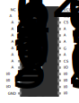
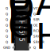
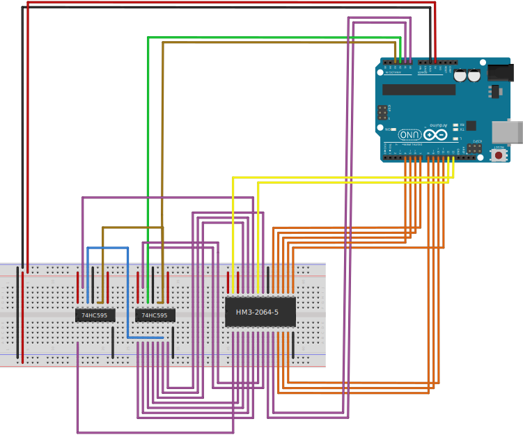

# External SRAM C++ Library for Arduino

This repository features a C++ library for an external SRAM for the Arduino Uno. More specifically the **HM3-2064-5** external RAM was used together with two **74HC595** shifting registers. This external RAM accepts $8192$ addresses each pointing to a single byte. The basic structure is, that the $13$-bit address is sent serially to the shifting registers and then the Arduino can perform a read or write on the specific address.\
As RAM access times are crucial for performance, the project is focused on reducing the overhead of the external RAM and shows the idea of using the faster internal RAM as a buffer - analog to how caching works on modern CPUs.


## 1 Hardware Setup
The pinout of the external SRAM **GM3-2064-5** can be seen in the graphic below. A<sub>0</sub> : A<sub>12</sub> are the pins for the $13$-bit address. I/O<sub>1</sub> : I/O<sub>8</sub> are I/O pins for the $8$ bit of the single byte at each specific address. For read and write operations, this library just uses the output enable pin <span style="text-decoration:overline">OE</span> and the write enable pin <span style="text-decoration:overline">WE</span>. Both chip select pins <span style="text-decoration:overline">CS</span><sub>1</sub> and CS<sub>2</sub> are fixed and thus not controlled by the Arduino. Further information can be found in the corresponding datasheet.

<p align="center">

</p>

As the Arduino has only $20$ I/O pins, shifting registers are used to receive the $13$-bit address serially. This is done by connecting two $8$-bit serial input parallel output **74HC595** shifting registers together, where the corresponding output pins of each register are connected to A<sub>0</sub> : A<sub>12</sub>. The output enable <span style="text-decoration:overline">OE</span> is fixed to be active. The SER pin is used for serial input at each rising edge of SRCLK. Further information can again be found in the datasheet.

<p align="center">

</p>

The following Circuit Diagram shows all connections between these components and the Arduino. The following color code is used:
* **Purple** wires are used for the $13$ address bits of the external ram where A<sub>0</sub>, A<sub>1</sub> and A<sub>2</sub> is connected directly to the Arduino with A<sub>2</sub> using the same pin as for serial communication with the shifting register. This setup allows for better performance when not just writing single bytes (e.g. floats with $4$ bytes each), which will be explained in more detail later.
* **Green** is used for the serial output of the arduino and the daisy chain serial wire between both shifting registers.
* **Ochre** is the clock signal for the serial input of the shifting registers.
* **Orange** wires are used for the $8$ I/O bits of the external ram connected directly to the Arduino to enable a parallel read and write after the address is set.
* **Yellow** are the read enable and write enable pins to initialize read or write operations at the specific address.
* **Black** GND
* **Red** $5$V

<p align="center">

</p>


## 2 Running the Project

### 2.1 Requirements

For Linux users there is a Makefile for compiling, flashing and connecting to serial port using ```screen``` or ```cu```. This makefile should also work for Mac users. Windows users could use an IDE like Microchip Studio. For the Makefile one needs the following packages, which are all available via package managers like apt.
* ```make```
* ```avr-libc``` (libraries)
* ```gcc-avr``` (compiling)
* ```avrdude``` (flashing)
* ```screen``` or ```cu``` (serial connection)

### 2.2 Usage of the Makefile

The Makefile automatically finds a connected Arduino. Calling just ```make``` without any further recipies will show you all possible main programs to flash on the Arduino together with two recipies to connect to the serial port via ```screen``` or ```cu```. As an example, to compile and flash the basic test program and to connect to the serial port using screen, one can use the following command if the Arduino is connected.
```
make test screen
```


## 3 Implementation

### 3.1 lib_extram

This is the core part of the repository. This library carries out the read and write access of the external RAM. The pinout and other useful definitions are found in ```config.hpp```.

The ```extram_setup()``` function needs to be called once and it configures the required I/O pins of the Arduino to communicate with the shifting registers and the external SRAM.

The ```send_addr_to_sr()``` funcion takes the $13$-bit address of the external SRAM and sends it serially to the shifting register. Notice that the code below only sends A<sub>3</sub> : A<sub>12</sub> to the shifting register, as ```ADDR_MSB``` is set to $12$ and ```ADDR_SR_LSB``` is set to $3$. The three least significant bits of the address A<sub>0</sub> : A<sub>2</sub> are connected directly to the Arduino. The purpose of this direct connection will be explained in the next paragraph with the read and write operations.
```C++
void send_addr_to_sr(uint16_t addr) {
    // send each bit starting from most significant
    for (uint16_t i = (1 << ADDR_MSB); i >= (1 << (ADDR_SR_LSB - 1)); i >>= 1) {
        if (addr & i)  // send 1 (green wire)
            PORT_SER |= MASK_SER;
        else  // send 0 (green wire)
            PORT_SER &= ~MASK_SER;

        // read into shifting register giving clock pulse (ochre wire)
        PORT_SRCLK |= MASK_SRCLK;
        PORT_SRCLK &= ~MASK_SRCLK;
    }
}
```

The funcion ```extram_read()``` and the function ```extram write()``` carry out the read and write operations on the external SRAM. They are implemented using templates, which makes it easy to store and access different data types on the external SRAM.\
The external SRAM is organized in bytes. If the considered data type contains multiple bytes, we will store it contiguous on the external SRAM. This is done using a reinterpret cast of the data pointer to ```uint8_t```. At this point it is important, that the three least significant bits A<sub>0</sub> : A<sub>2</sub> of the address are connected directly to the Arduino. Because of this, it suffices to call the costly ```send_addr_to_sr()``` function only once to jump to the right position on the external SRAM, while we can access the following contiguous bytes by changing A<sub>0</sub> : A<sub>2</sub> directly. This increases performance significantly for larger data types, as we will later see in the benchmarks. The only requirement is, that the address has to be a multiple of the size of the data type.\
The actual read and write command is given to the external SRAM by changing the state of the output enable <span style="text-decoration:overline">OE</span> and write enable <span style="text-decoration:overline">WE</span> accordingly.

```C++
template <typename T>
T extram_read(uint16_t addr, uint16_t ind = 0) {
    // extram address
    uint16_t addr_extram = addr + ind * sizeof(T);

    // variable to return
    T data;

    // pointer to read the single bytes
    uint8_t *ptr = reinterpret_cast<uint8_t *>(&data);

    // send starting address to shifting register
    send_addr_to_sr(addr_extram);

    // set OE active (yellow wire)
    PORT_OE &= ~MASK_OE;

    // set IO pins to input with pullup (orange wires)
    DDR_IO0 &= ~MASK_IO0;
    PORT_IO0 |= MASK_IO0;
    DDR_IO1 &= ~MASK_IO1;
    PORT_IO1 |= MASK_IO1;

    // read the single bytes
    for (uint8_t i = 0; i < sizeof(T); i++) {
        // least significant bits of address (purple wires A0:A2)
        PORT_ADDRLSB &= ~MASK_ADDRLSB;
        PORT_ADDRLSB |= MASK_ADDRLSB & (addr_extram + i);

        // wait for output ready
        _delay_us(0.12);

        // read from external RAM (orange wires)
        ptr[i] = PIN_IO0 & MASK_IO0;
        ptr[i] |= PIN_IO1 & MASK_IO1;
    }

    // set OE inactive (yellow wire)
    PORT_OE |= MASK_OE;

    // return
    return data;
}
```

```C++
template <typename T>
void extram_write(T &data, uint16_t addr, uint16_t ind = 0) {
    // extram address
    uint16_t addr_extram = addr + ind * sizeof(T);

    // pointer to write single bytes
    uint8_t *ptr = reinterpret_cast<uint8_t *>(&data);

    // send starting address to shifting register
    send_addr_to_sr(addr_extram);

    // set IO pins to output (orange wires)
    DDR_IO0 |= MASK_IO0;
    DDR_IO1 |= MASK_IO1;

    // write the single bytes
    for (uint8_t i = 0; i < sizeof(T); i++) {
        // least significant bits of address (purple wires A0:A2)
        PORT_ADDRLSB &= ~MASK_ADDRLSB;
        PORT_ADDRLSB |= MASK_ADDRLSB & (addr_extram + i);

        // set IO pins (orange wires)
        PORT_IO0 &= ~MASK_IO0;
        PORT_IO0 |= ptr[i] & MASK_IO0;
        PORT_IO1 &= ~MASK_IO1;
        PORT_IO1 |= ptr[i] & MASK_IO1;

        // write to external RAM by giving low pulse on WE (yellow wire)
        PORT_WE &= ~MASK_WE;
        PORT_WE |= MASK_WE;
    }
}
```

#### test: functionality

This is a simple test which checks the functionality of the external RAM. It should be run after connecting the hardware to make sure that everything is working. For a few different data types, a vector is written to addresses spread randomly over the whole external SRAM and the user is notified if are any errors when reading the data again.

#### test_perf: read/write times for vector of different data types with fixed length

This is a test which measures the time of reading and writing a vector of length $1024$ of different data types on external RAM. The following table shows the results.

| data type           | size[B] | write time [ms] | read time [ms] |
| -------------------: | :-------: | :---------------: | :--------------: |
| uint8_t             | $1$     | $8$             | $8$            |
| uint16_t            | $2$     | $11$            | $10$           |
| uint32_t <br> float | $4$     | $15$            | $13$           |
| uint64_t            | $8$     | $21$            | $16$           |

It seems like reading is slightly faster than writing for bigger data types. This makes sense, as one iteration of the for loop over the single bytes of  ```extram_write()``` is a little bit more costly compared to ```extram_read()```.\
Additionally we can nicely see the use of the three least significant bits of the address A_<sub>0</sub> : A<sub>2</sub> being connected directly to the Arduino. Altough ```uint64_t``` is $8$ times the size of ```uint8_t```, it takes less than $3$ times the time for reading and writing. This is because we are calling the costly function to send the most significant bits to the shifting register only once independently of the data type and then just change the directly connected bits A<sub>0</sub> : A<sub>2</sub>.

#### test_bandwidth: read/write bandwidth for different data types

This raises the question of the bandwidth of the read and write operations for each datatype. For this measurement, the time to read and write the whole external RAM with different datatypes is measured to calculate the corresponding bandwith. The following table shows the results.

| data type          | size [B] | write time [ms] | write bandwidth [kB/s] | read time [ms] | read bandwidth [kB/s] |
| ------------------: | :--------: | :---------------: | :----------------------: | :--------------: | :---------------------: |
| uint8_t            | $1$      | $70$            | $117$                  | $70$           | $117$                 |
| uint16_t           | $2$      | $45$            | $182$                  | $42$           | $195$                 |
| uint32_t <br>float | $4$      | $30$            | $273$                  | $26$           | $315$                 |
| uint64_t           | $8$      | $21$            | $390$                  | $16$           | $512$                 |

This underlines the assumption from above, that reading is slightly faster than writing - especially for larger data types. The bandwidth results nicely show, how the direct control of the three least significant bits of the address improves bandwidth for bigger data types by avoiding the costly calls of ```send_addr_to_sr()``` for each byte.

### 3.2 lib_sort

This is a library for benchmarking the Bubblesort algorithm. Bubblesort is implemented on internal RAM and on external RAM. Additionally there is a chunked bubblesort. The list to be sorted is divided into $n_\text{chunks}$ chunks. These chunks are sorted and later merged into the full sorted list. The simple approach implemented here requires another list of full length to store the result. The chunks for the external Bubblesort algorithm are sorted on internal and external RAM for comparison. This corresponds to the idea of caching on modern CPUs.

#### test_sort_uint8 and test_sort_uint16 and test_sort_uint32 to measure bubblesort performance

The following table shows the time to sort a vector of length $256$ of different data types using the different Bubblesort approaches. If chunks are used, then the number of chunks is always $n_\text{chunks} = 16$.

|                        method | time uint8_t [ms] | time uint16_t [ms] | time uint32_t [ms] |
| ----------------------------: | :---------------: | :----------------: | :----------------: |
|  internal list without chunks |       $27$        |        $46$        |        $77$        |
|  external list without chunks |       $829$       |       $1027$       |       $1356$       |
| internal list internal chunks |        $6$        |        $8$         | *not enough space* |
| external list external chunks |       $57$        |        $71$        |        $93$        |
| external list internal chunks |       $14$        |        $18$        |        $24$        |

The chunked Bubblesort algorithm is out of competition compared to standart Bubblesort. This is because the computational effort of Bubblesort grows quadratically with the length $n$ of the list, but the cost of merging the sorted chunks only depends on $n \cdot n_\text{chunks}$.\
For normal Bubblesort the performance on the external RAM is way worse compared to the internal RAM with a factor of $20$ - $30$. The reason for this probably is the high number of read operations required just for comparisons without any swapping. Additionally our functions for reading and writing the external RAM can not be optimized as well by the compiler, as the reads and writes on the internal RAM.\
The performance difference for chunked Bubblesort between internal RAM and external RAM with external chunks is smaller with around factor $9$, but the internal RAM reaches its limit quite fast. It was not possible to sort $256$ ```uint32_t``` values, as the corresponding vector takes $1024$ bytes of RAM and we need another vector of this length for merging the sorted chunks.\
Let us consider the external RAM as the main RAM and the internal RAM as a cache analog to modern CPUs, which have way faster but also smaller caches additionally to the RAM. Between the external Bubblesort with external chunks and internal chunks, the required time is around $75\%$ lower for all three data types, which underlines the impact of caching on performance.


### 3.3 lib_poisson

This is another library for benchmarking. The 2d-Poisson equation with dirichlet boundary conditions on the unit square $\Omega = [0, 1]^2$

$$
-\Delta \phi = f \text{ with respect to } \phi = 0 \text{ on } \delta \Omega
$$

is solved using a Jacobi-solver with a mesh of $(N+2)^2$ points for discretization. The according Jacobi grid update can be written as

$$
\phi^\text{new}_{i,j} = \frac{1}{4} \left(\phi^\text{old}_{i+1,j} + \phi^\text{old}_{i-1,j} + \phi^\text{old}_{i,j+1} + \phi^\text{old}_{i,j-1} - f_{i,j}\right) \text{ for } i,j \in \{1, \dots, N+1\}\text{.}
$$

Typically $\phi^\text{new}$ and $\phi^\text{old}$ are both allocated in storage, but because of the very limited RAM of the Arduino, only space for one $\phi$ is allocated in storage and a buffer is used for the entries of $\phi$ which have been overwritten but are required again as left and top neighbours.\
The function ```solve()``` is implemented on the internal RAM. The function ```solve_extram()``` is implemented on external RAM with the described buffer also on external RAM. ```solve_extram_buffered()``` has the buffer allocated on internal RAM, reducing the number of external RAM accesses. The function ```solve_extram_doublebuffered()``` has a even bigger buffer on the internal RAM to reduce the number of external RAM accesses further.

#### test_poisson: poisson jacobi-solver showing the idea of caching on modern CPUs

The following table shows the times for solving the 2d-Poisson equation with $f$ defined in ```lib_poisson.cpp``` with the different methods described above for $N = 10$.

|                   method | description                                     | time [ms] |
| -----------------------: | ----------------------------------------------- | :-------: |
|                 internal | internal $\phi$ with internal buffer            |  $1587$   |
|                 external | external $\phi$ with external buffer            |  $4142$   |
|        external buffered | external $\phi$ with internal buffer            |  $3160$   |
| external double buffered | external $\phi$ with additional internal buffer |  $2952$   |

This shows that using only the external RAM is slower, but in this case it takes just $2.6$ times longer on the external RAM compared to the internal RAM. The other times are really interesing in the following sense.\
Let us again consider the external RAM as the main RAM and the internal RAM as a cache analog to modern CPUs. Then the two implementations using the internal cache as a buffer show, how caching can improve performance. The most sophisticated caching approach reduces the time by around $30\%$, but in our case, the internal RAM is not that much faster than the external RAM. If the difference is bigger, one can expect even bigger relative performance improvements.

This paragraph is meant as an outlook. On modern CPUs, the compiler tries its best to make use of the cache by itself, but sometimes the user has to change the program slightly to make caching possible.\
In our specific case, the following problem could arise. We are using a vector of length $(N+1)$ in the simple caching approach and a vector of length $2(N+1)$ in the more sophisticated one. If it happens that the internal RAM is too small to store these vectors, our caching approach will not longer work. In practical examples, this problem can happen easily, as caches are typically much smaller than RAM memory.\
But in our specific example, this problem can easily be fixed. At the moment, the grid udpate is calculated row-wise. Cutting the grid in stripes and using the row-wise approach afterwards makes it possible to use a buffer depending on the stripe width instead of the whole width $N$. Considering such things can have a big impact on performance. Profilers are the means of coiche to analyse such problems.


### 3.4 lib_usart

This is a helper libary for serial printing using the ```USART```. One could also use the ```serial``` library from the Arduino IDE. After calling the ```usart_setup()``` function once, all implemented serial print funcions for the specific data types can be used.

### 3.5 lib_timer

This is a helper library to measure elapsed time in ms using the ```Timer/Counter 0```. One could also use ```millis()``` command from Arduino IDE. The following code shows the basic usage.

```C++
// setup millisecond timer
timer_setup(); // only one call required
uint32_t t;

// measure and print time
timer_reset();
// CODE TO BE MEASURED HERE
t = timer_getms();
serprintuint32(t);
serprint(" ms\n\r");
```

#### test_timer: estimate timer overhead

This test tries to find the overhead caused by the time measurement. If one plugs in $100$ s in the ```_delay_ms()``` function from ```util/delay.h```, then we measure the following times with the ```lib_time``` library for counting milliseconds and decimilliseconds respectively.

|  OCR1A | precision [ms] | time [ms] for ```_delay_ms(100000)``` | overhead |
| -----: | :------------: | :-----------------------------------: | :------: |
| $1999$ |      $1$       |               $100382$                | $0.38\%$ |
|  $199$ |     $0.1$      |              $103963.6$               | $3.96\%$ |

One could set ```OCR1A``` a little bit lower to compensate the overhead, but this might depend on compiler options, which is why we will just leave it at $1999$. In this case the overhead was only about $0.38\%$, which we usually will not even notice, as our timer is only counting full milliseconds. Additionally the timer overhead should be linear, which makes all measured times easily comparable.


## 4. Resources

[Datasheet **HM3-2064-5**](https://www.datasheetarchive.com/pdf/download.php?id=a5026d50578d71a1c896b4f3ad4d3b9ebe7fe6&type=O&term=HM3-2064U-5)\
[Datasheet **74HC595**](https://www.google.com/url?sa=t&rct=j&q=&esrc=s&source=web&cd=&cad=rja&uact=8&ved=2ahUKEwjw4KHUqaz9AhUXQfEDHaV8AxgQFnoECBAQAQ&url=https%3A%2F%2Fwww.ti.com%2Flit%2Fpdf%2Fscls041&usg=AOvVaw3xTg3mGuz-5PPZmidRxmCT)\
[Bubblesort](https://de.wikipedia.org/wiki/Bubblesort)\
[Discrete Poisson Equation](https://en.wikipedia.org/wiki/Discrete_Poisson_equation)\
[Jacobi-solver](https://en.wikipedia.org/wiki/Jacobi_method)