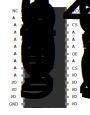

# External SRAM C++ library for Arduino

This repository features an implementation of a C++ library for an external SRAM for the Arduino Uno. More specifically the **HM3-2064-5** external RAM was used together with two **74HC595** shifting registers. This external RAM accepts $8192$ addresses each pointing to a single byte. The basic structure is, that the $13$-bit address is sent serially to the shifting registers and then the Arduino can perform a read or write on the specific address.\
As acces times on RAM memory are crucial for performance, the project is focused on reducing the overhead of the external RAM and shows the idea of buffering in the faster internal RAM - analog to how caching works on modern CPUs.

## 1 Hardware Setup
The pinout of the external SRAM **GM3-2064-5** can be seen in the graphic below. $A_0:A_{13}$ are the pins for the $13$-bit address. $I/O_1 : I/O_8$ are I/O pins for the $8$ bit of the single byte at each specific address. For read and write operations, this library just uses the output enable pin $\overline{OE}$ and the write enable pin $\overline{WE}$. Both chip select pins $CS_1$ and $CS_2$ are fixed and thus not controlled by the Arduino. Further information can be found in the corresponding datasheet.

<p align="center">

</p>

As the Arduino has only $20$ I/O pins, we are using shifting registers to receive the $13$-bit address serially. This is done by connecting two $8$-bit serial input parallel output **74HC595** shifting registers together, where the corresponding output pins of each register are connected to $A_0 : A_{12}$. The output enable $\overline{OE}$ is fixed to be active. The $SER$ pin is used for serial input at each rising edge of $SRCLK$. Further information can again be found in the datasheet.

<p align="center">

</p>

The following Circuit Diagram shows all connections between these components and the Arduino. The following color code is used:
* **purple** wires are used for the $13$ address bits of the external ram where A0, A1 and A2 is connected directly to the Arduino with A2 using the same pin as for serial communication with the shifting register. This setup allows for better performance when not just writing single bytes(e.g. floats with $4$ bytes each), which will be explained in more detail later.
* **green** is used for the serial output of the arduino and the daisy chain serial wire between both shifting registers
* **ochre** is the clock signal for the serial input of the shifting registers
* **orange** wires are used for the $8$ I/O bits of the external ram connected directly to the arduino to enable a parallel read and write if the address is set
* **yellow** are the read enable and write enable pins to initialize read or write operations on the specific address
* **black** GND
* **red** $5$V

<p align="center">

</p>

## 2 Running the Project

### 2.1 Requirements

For Linux users there is a Makefile for compiling, flashing and connecting to serial port using ```screen``` or ```cu```. This makefile should also work for Mac users. Windows users could use an IDE like Microchip Studio. For the Makefile one needs the following packages, which are all available via the package managers like apt:
* ```make```
* ```avr-libc``` (libraries)
* ```gcc-avr``` (compiling)
* ```avrdude``` (flashing)
* ```screen``` or ```cu``` (serial connection)

### 2.2 Usage of the Makefile

The Makefile automatically finds a connected Arduino. Calling just ```make``` without any further recipies will show you all possible main programs to flash on the Arduino together with two recipies to connect to the serial port via screen or cu. As an example, to compile and flash the basic test program and to connect to the serial port, one can use the following command.
```
make test screen
```


## 3 Implementation

There are several libraries in the project. The main library for communication with the external SRAM is ```lib_extram```. ```lib_usart``` ```lib_time``` ```lib_sort``` ```lib_poisson```

### 3.1 Libraries

#### lib_extram

#### lib_poisson

#### lib_sort

#### lib_time

#### lib_usart


### 3.2 Tests

#### test_perf_fill

#### test_perf

#### test_poisson

#### test_sort_uint8

#### test_sort_uint16

#### test_time to estimate timer overhead

The program ```test_timer.cpp``` tries to find the overhead caused by the time measurement implemented in ```lib_time```. If one plugs in $100$ s in the ```_delay_ms()``` function from ```util/delay.h```, then we measure the following times with the ```lib_time``` library for counting milliseconds and decimilliseconds respectively.

| OCR1A  | precision | measured time for 100s | overhead |
| ------ | --------- | ---------------------- | -------- |
| $1999$ | $1$ ms    | $100382$ ms            | $0.38\%$ |
| $199$  | $0.1$ ms  | $103963.6$ ms          | $3.96\%$ |

One could set ```OCR1A``` a little bit lower to compensate the overhead, but this might depend on compiler option which is why we will just leave it at $1999$. In this case the overhead was only about $0.38\%$ which we usually will not even notice as our timer is only counting full milliseconds.