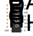

# arduino-extram

Implementation of a C++ library for an external RAM for the Arduino Uno. More specifically the **HM3-2064-5** external RAM was used together with two **74HC595** shifting registers. This external RAM accepts $8192$ addresses each pointing to a single Byte of storage. The basic structure is, that the address is sent serially to the shifting registers and then the Arduino can perform a read or write on the specific address. As acces times on RAM memory can have a big impact on performance, the project is focused on reducing the overhead of the external RAM.

## Hardware Setup




The following Circuit Diagram shows all connections used in the project. The color Code is the following:
* **purple** wires are used for the $13$ address bits of the external ram where A0, A1 and A2 is connected directly to the Arduino with A2 using the same pin as for serial communication with the shifting register
* **orange** wires are used for the $8$ I/O bits of the external ram connected directly to the arduino
* **yellow**
* **green**
* **ochre**
* **red**
* **black**


## Usage and Requirements

### Requirements

For Linux users there is a Makefile for compiling, flashing and connecting to serial port using ```screen``` or ```cu```. This makefile should also work for Mac users. Windows users could use an IDE like Microchip Studio. For the Makefile one needs the following packages which are all available via the package managers like apt:

* ```make```
* ```avr-libc``` (libraries)
* ```gcc-avr``` (compiling)
* ```avrdude``` (flashing)
* ```screen``` or ```cu``` (serial connection)

### Usage
*how to use the Makefile*


## Timer Overhead

The program ```test_timer.cpp``` tries to find the overhead caused by the time measurement implemented in ```lib_time```. If one plugs in $100$ s in the ```_delay_ms()``` function from ```util/delay.h```, then we measure the following times with the ```lib_time``` library for counting milliseconds and decimilliseconds respectively.

| OCR1A  | precision | measured time for 100s | overhead |
| ------ | --------- | ---------------------- | -------- |
| $1999$ | $1$ ms    | $100382$ ms            | $0.38\%$ |
| $199$  | $0.1$ ms  | $103963.6$ ms          | $3.96\%$ |

One could set ```OCR1A``` a little bit lower to compensate the overhead, but this might depend on compiler option which is why we will just leave it at $1999$. In this case the overhead was only about $0.38\%$ which we usually will not even notice as our timer is only counting full milliseconds.

## Structure

### Libraries

#### lib_extram

#### lib_poisson

#### lib_sort

#### lib_time

#### lib_usart


### Tests

#### test_perf_fill

#### test_perf

#### test_poisson

#### test_sort_uint8

#### test_sort_uint16

#### test_time