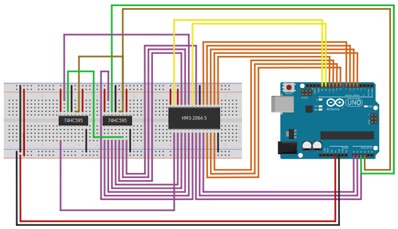

# arduino_extram

Implementation of a C library for an external RAM for the Arduino Uno.

*further Description will follow*

## Hardware Setup

### Shifting Register
| left          | right                                               |
| ------------- | --------------------------------------------------- |
| Q<sub>B</sub> | VCC                                                 |
| Q<sub>C</sub> | Q<sub>A</sub>                                       |
| Q<sub>D</sub> | SER                                                 |
| Q<sub>E</sub> | <span style="text-decoration:overline">OE</span>    |
| Q<sub>F</sub> | RCLK                                                |
| Q<sub>G</sub> | SRCLK                                               |
| Q<sub>H</sub> | <span style="text-decoration:overline">SRCLR</span> |
| GND           | Q<sub>H</sub>'                                      |

### SRAM
| left            | right                                             |
| --------------- | ------------------------------------------------- |
| NC              | VCC                                               |
| A<sub>12</sub>  | <span style="text-decoration:overline">WE</span>  |
| A<sub>7</sub>   | CS2                                               |
| A<sub>6</sub>   | A<sub>8</sub>                                     |
| A<sub>5</sub>   | A<sub>9</sub>                                     |
| A<sub>4</sub>   | A<sub>11</sub>                                    |
| A<sub>3</sub>   | <span style="text-decoration:overline">G</span>   |
| A<sub>2</sub>   | A<sub>10</sub>                                    |
| A<sub>1</sub>   | <span style="text-decoration:overline">CS1</span> |
| A<sub>0</sub>   | I/O<sub>8</sub>                                   |
| I/O<sub>1</sub> | I/O<sub>7</sub>                                   |
| I/O<sub>2</sub> | I/O<sub>6</sub>                                   |
| I/O<sub>3</sub> | I/O<sub>5</sub>                                   |
| GND             | I/O<sub>4</sub>                                   |



## Usage and Requirements

### Requirements

For Linux users there is a Makefile for compiling, flashing and connecting to serial port using ```screen``` or ```cu```. This makefile should also work for Mac users. Windows users could use an IDE like Microchip Studio. For the Makefile one needs the following packages which are all available via the package managers like apt:

* ```make```
* ```avr-libc``` (libraries)
* ```gcc-avr``` (compiling)
* ```avrdude``` (flashing)
* ```screen``` or ```cu``` (serial connection)

### Usage
*how to use the Makefile*


## Timer Overhead

The program ```test_timer.cpp``` tries to find the overhead caused by the time measurement implemented in ```lib_time```. If one plugs in $100$ s in the ```_delay_ms()``` function from ```util/delay.h```, then we measure the following times with the ```lib_time``` library for counting milliseconds and decimilliseconds respectively.

| OCR1A  | precision | measured time for 100s | overhead |
| ------ | --------- | ---------------------- | -------- |
| $1999$ | $1$ ms    | $100382$ ms            | $0.38\%$ |
| $199$  | $0.1$ ms  | $103963.6$ ms          | $3.96\%$ |

One could set ```OCR1A``` a little bit lower to compensate the overhead, but this might depend on compiler option which is why we will just leave it at $1999$. In this case the overhead was only about $0.38\%$ which we usually will not even notice as our timer is only counting full milliseconds.